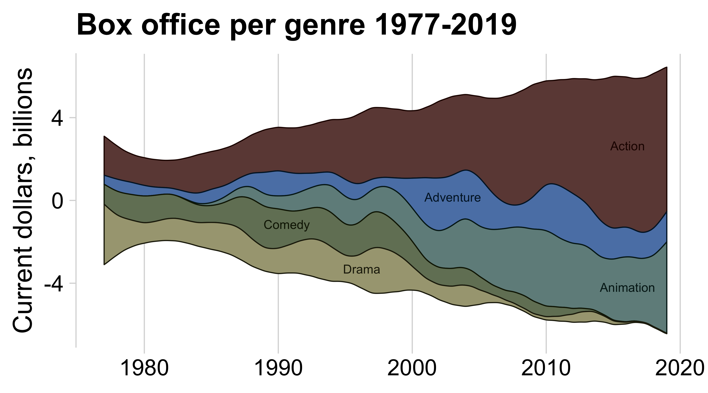
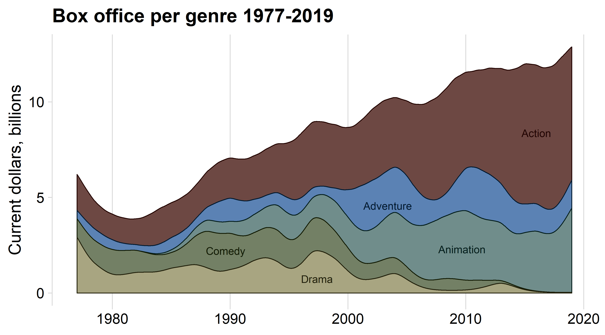
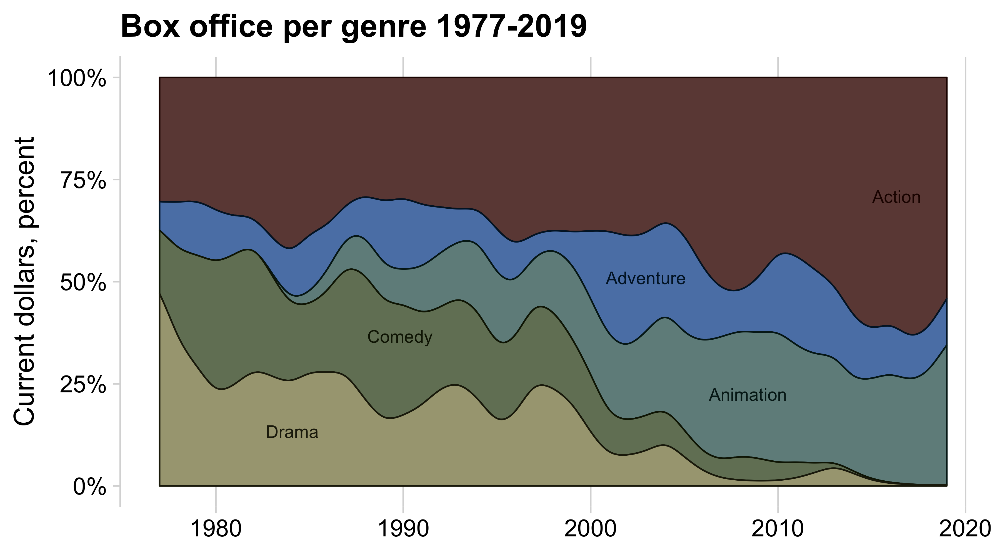
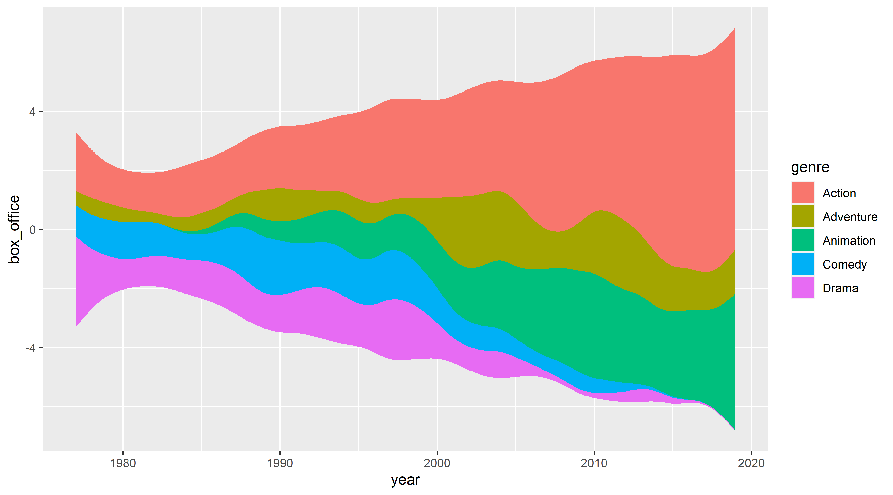
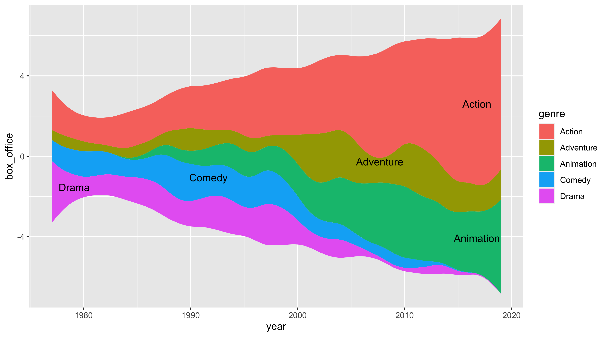
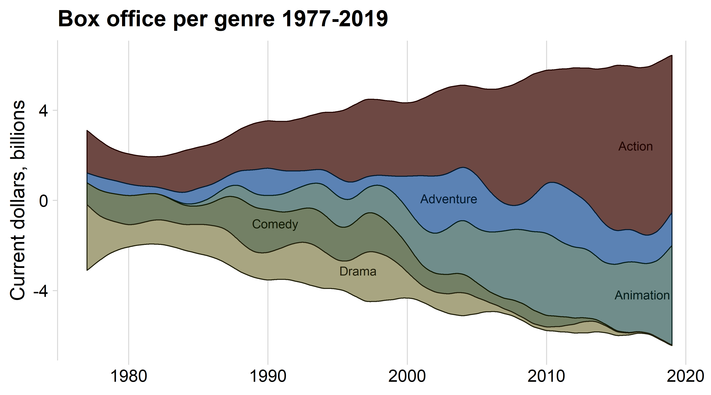
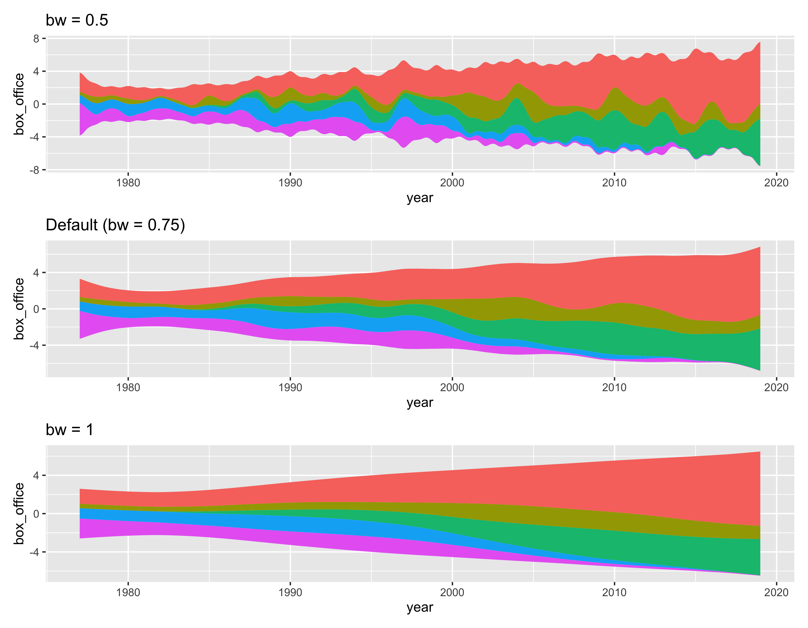
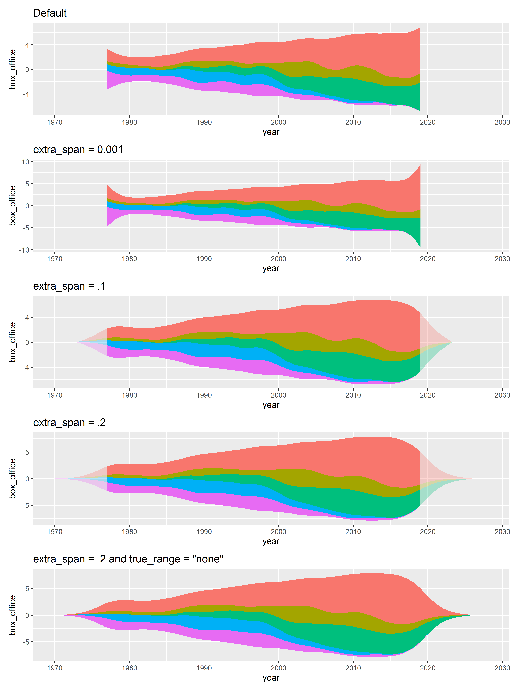

<!-- README.md is generated from README.Rmd. Please edit that file -->

# ggstream

<!-- badges: start -->

[](https://github.com/davidsjoberg/ggstream/actions)
<!-- badges: end -->

The goal of `ggstream` is to create a simple but powerful implementation
of streamplot/streamgraph in `ggplot2`. A streamplot is a stacked area
plot mostly used for time series.

This is a development, expect breaking changes before submission to
CRAN.

## Installation

You can install the development version of ggstream from github with:

``` r
remotes::install_github("davidsjoberg/ggstream")
```

## Examples

#### Type: Mirror

The characteristic streamplot which creates a symmetrical area chart
around the x axis.



#### Type: Ridge

Which is equivalent to a stacked area chart.



#### Type: Proportional

The type `proportional` shows the share of each group in percent.
Stacked like the `ridge` type.



## Basic usage

This is a basic example:

``` r
library(ggstream)

ggplot(blockbusters, aes(year, box_office, fill = genre)) +
  geom_stream()
```



`ggstream` also features a custom labeling geom that places decent
default labels.

``` r
ggplot(blockbusters, aes(year, box_office, fill = genre)) +
  geom_stream() +
  geom_stream_label(aes(label = genre))
```



#### Add some pimp

``` r
library(cowplot)
library(paletteer)
library(dplyr)
library(colorspace)

blockbusters %>%
  ggplot(aes(year, box_office, fill = genre, label = genre, color = genre)) +
    geom_stream(extra_span = 0.013, type = "mirror", n_grid = 3000, bw = .78) +
    geom_stream_label(size = 4, type = "mirror", n_grid = 1000) +
  cowplot::theme_minimal_vgrid(font_size = 18) +
  theme(legend.position = "none") +
  scale_colour_manual(values = paletteer::paletteer_d("dutchmasters::milkmaid") %>% colorspace::darken(.8)) +
  scale_fill_manual(values = paletteer::paletteer_d("dutchmasters::milkmaid") %>% colorspace::lighten(.2)) +
  labs(title = "Box office per genre 1977-2019",
       x = NULL,
       y = "Current dollars, billions")
```



## Advanced parameters

### bw

The main parameter to adjust in `geom_stream` is probably the bandwidth,
or `bw`. A lower bandwidth creates a more bumpy plot and a higher
bandwidth smoothens out some variation. Below is an illustration of how
different bandwidths affect the stream plot.

``` r
library(patchwork)

base <- ggplot(blockbusters, aes(year, box_office, fill = genre)) + 
  theme(legend.position = "none")

(base +  geom_stream(bw = 0.5) + ggtitle("bw = 0.5")) /
(base +  geom_stream() + ggtitle("Default (bw = 0.75)")) /
(base +  geom_stream(bw = 1) + ggtitle("bw = 1"))
```



### Extra Span

Another important parameter to adjust is `extra_span`. This parameter
adjust if a larger range than the range of the data which can help if
the edges of the stream plot grows too large due in the estimation
function. The additional range is set to y = 0 which forces the area
towards zero. The cut-off can include the extra range or fit the data.
Too illustrate this rather unintuitive parameter some variations are
shown below. The transparent areas show the full estimation, and the
solid area is the final plot.

``` r
base <- ggplot(blockbusters, aes(year, box_office, fill = genre)) + 
  theme(legend.position = "none") +
  xlim(1970, 2028)

(base +  geom_stream() + ggtitle("Default")) /
(base +  geom_stream(extra_span = 0.001) + geom_stream(extra_span = 0.001, true_range = "none", alpha = .3) + ggtitle("extra_span = 0.001")) /
(base +  geom_stream(extra_span = .1) + geom_stream(extra_span = .1, true_range = "none", alpha = .3) + ggtitle("extra_span = .1")) /
(base +  geom_stream(extra_span = .2) + geom_stream(extra_span = .2, true_range = "none", alpha = .3) + ggtitle("extra_span = .2")) /
(base +  geom_stream(extra_span = .2, true_range = "none") + ggtitle("extra_span = .2 and true_range = \"none\""))
```



## Final remarks

The `ggstream` package provides some flexible ways to make stream plots
but with decent defaults. However, due to the complexity of the
underlying smoothing/estimation it should be used carefully and mostly
for fun too illustrate major trends.

If you find a bug or have ideas for additional feature you are more than
welcome to open an issue.
